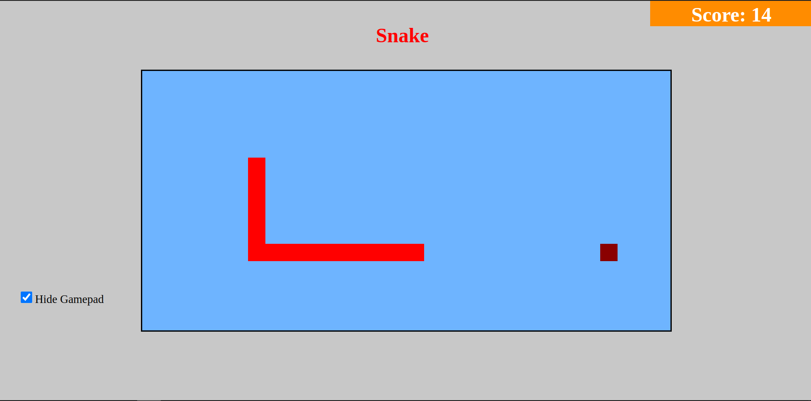

# WebSnake
WebSnake é um jogo da cobrinha (Snake Game) desenvolvido utilizando HTML, CSS e JavaScript.

## Funcionalidades
- Controles simples usando as teclas de direção para mover a cobrinha.
- A cobrinha cresce ao comer a comida gerada aleatoriamente.
- Pontuação exibida na tela para acompanhar o progresso do jogador.

## Como Jogar
1. **Comece o jogo**: Abra o arquivo `index.html` em um navegador web.
2. **Controles**:
   - Utilize as teclas de direção (setas) para movimentar a cobrinha.
   - Evite colidir com as bordas ou com o próprio corpo da cobrinha.
   - Colete a comida para aumentar o tamanho da cobrinha e pontuação.
3. **Pontuação**: A pontuação aumenta conforme a cobrinha coleta a comida.
4. **Fim do Jogo**: O jogo termina quando a cobrinha colide com as bordas ou consigo mesma.

## Contribuição
Contribuições são bem-vindas! Se você deseja melhorar este jogo, siga estes passos:
1. Faça um fork deste repositório.
2. Crie uma branch para suas modificações: `git checkout -b minha-feature`.
3. Faça commit das alterações: `git commit -m 'Adicionando funcionalidade X'`.
4. Envie as alterações para o repositório remoto: `git push origin minha-feature`.
5. Abra um pull request explicando suas modificações.

## Recursos Utilizados
- HTML5
- CSS3
- JavaScript

## Autor
João Pedro Tomaz dos Santos - [JoaoSantos2007](https://github.com/JoaoSantos2007)

## Licença
Este projeto está licenciado sob a [Licença MIT](LICENSE).

---

Divirta-se jogando o WebSnake! 🐍🎮
